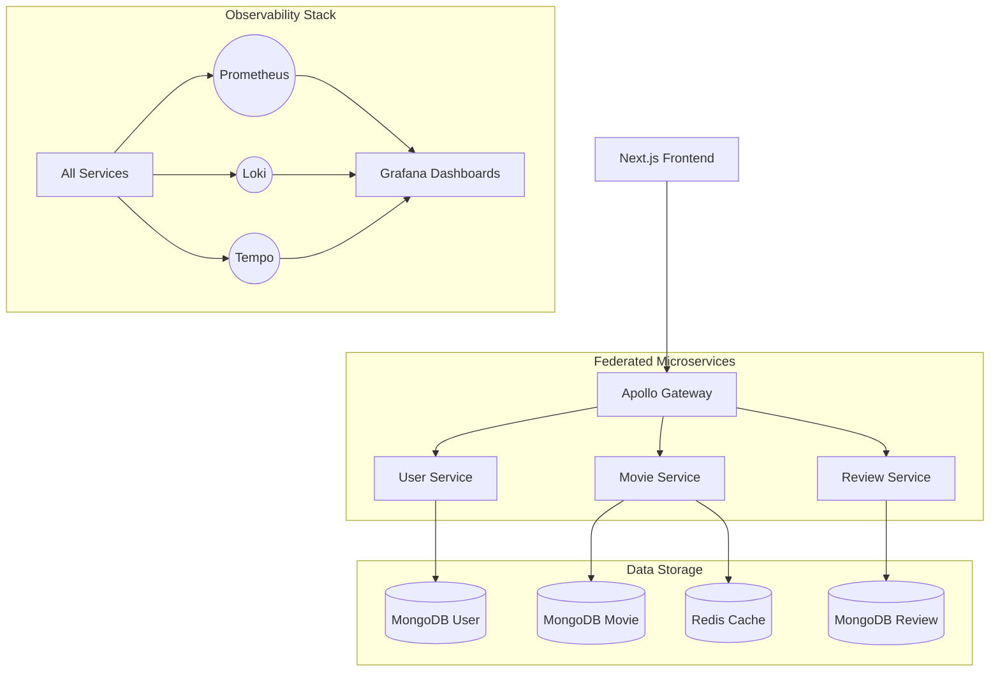

# Netflix Clone - Microservices & Observability Demo

A full-stack Netflix Clone demonstration platform built with **Next.js 14**, **Apollo Federated GraphQL**, and a high-performance **Observability Stack** (Prometheus, Loki, Tempo, Grafana).

## System in brif video
 [Watch_Video](https://www.awesomescreenshot.com/video/50432919?key=ca2f1376ace0eb48921086f944df7ea5)

## Project Overview

This project serves as a reference implementation for a modern microservices architecture with a focus on deep observability. It features a complete frontend, a federated backend, and an integrated system for intentionally injecting anomalies to test reliability and monitoring.

### 🏗 Architecture



---

## 📂 Project Structure

```text
├── client/                 # Next.js 14 Frontend
│   ├── app/                # App Router (Pages & Layout)
│   ├── components/         # Atomic UI Components
│   └── lib/                # Apollo Client & Hooks
├── server/                 # Backend Workspace
│   ├── gateway/            # Apollo Federation Gateway
│   ├── services/           # Microservices
│   │   ├── user-service/   # Auth & Identity
│   │   ├── movie-service/  # Catalog & Metadata
│   │   └── review-service/ # Social & Engagement
│   ├── packages/           # Shared Libraries (Tracing, Logger, Metrics)
│   ├── monitoring/         # Grafana, Prometheus, Loki, Tempo configs
│   ├── load-tests/         # k6 Load Testing Scripts
│   └── docker-compose.yml  # Full Stack Orchestration
```

---

## 🛠 Features & Services

### 1. **Next.js Frontend**
- Server-Side Rendering (SSR) for SEO and performance.
- Dynamic layouts with Tailwind CSS.
- Real-time updates via Apollo Client.

### 2. **Apollo Federated Gateway**
- Acts as a single entry point for all GraphQL requests.
- Merges schemas from all subgraphs into a unified API.
- Handles cross-service authentication and request propagation.

### 3. **Microservices**
- **User Service**: Manages registration, login (JWT), and user profiles. Uses MongoDB for persistence.
- **Movie Service**: Manages the movie catalog, handling complex queries and caching results in Redis.
- **Review Service**: Manages user-generated reviews, linked to both Users and Movies via Federated keys.

### 4. **Observability Stack**
- **Prometheus**: Scrapes metrics from all services (Requests, Latency, DB, Resolvers).
- **Loki**: Aggregates structured logs with OTel trace context support.
- **Tempo**: Provides distributed tracing to visualize request flow across services.
- **Grafana**: Beautifully visualizes all telemetry in pre-built dashboards (`app-health`, `db-performance`, `logs`).

---

## 🚀 Getting Started

### Prerequisites
- Docker & Docker Compose
- MSYS/Git Bash (on Windows)

### Running the App
1. **Start the Backend Stack**:
   ```bash
   cd server
   docker-compose up -d
   ```
2. **Start the Frontend**:
   ```bash
   cd client
   npm install
   npm run dev
   ```
   Access the UI at [http://localhost:3000](http://localhost:3000).

3. **Access Monitoring**:
   - **Grafana**: [http://localhost:3000](http://localhost:3000) (Admin / Admin)
   - **Prometheus**: [http://localhost:9090](http://localhost:9090)

---

## 🔍 Proving Observability (Anomaly Injection)

This project includes a system to intentionally break the app to verify your monitoring.

### Anomaly: slow-query
Injects a 2000ms delay into the movie-service.
- **Verification**: `Failure Rate %` panel in Grafana spikes. Logs show `ANOMALY: artificial delay injected`.

### Anomaly: flaky
Triggers random 500 errors in 40% of requests.
- **Verification**: Error Rate stat panel turns RED. Traces in Tempo show failed spans.

### Anomaly: memory-leak
Simulates a heap leak in the movie-service.
- **Verification**: `process_heap_used_bytes` metric shows a "sawtooth" or growing pattern.

### How to Trigger:
```bash
# Enable slow query anomaly
curl -X POST http://localhost:4002/anomaly/set -H "Content-Type: application/json" -d '{"type":"slow-query"}'

# Execute load test to observe impact
docker run --rm -v "${PWD}:/scripts" -i --network=host grafana/k6 run /scripts/load-tests/anomaly-test.js
```

Refer to the [load-tests/README.md](./server/load-tests/README.md) for detailed instructions on running k6 tests.
